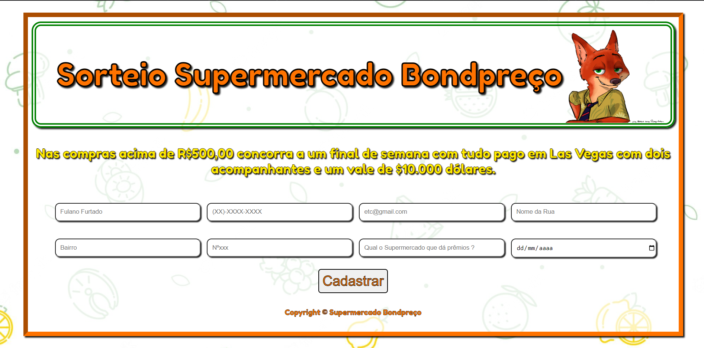

## Formulário promoção Supermercado Bondpreço

Link do projeto: (em breve)

### Sobre
É uma simulação de cadastro de sorteio de um supermercado para uma viagem para Las Vegas.
### Objetivos
Principal objetivo é aplicar o Media Query para que o site fique responsivo para alguns dispositivos.
### Desafios
Este é o primeiro projeto que faço com foco no Media Query, verificando a diferença de tela de cada um, o famoso "Devices Breakpoints". Adicionarei também alguma funcionabilidade de JavaScript.

### Conclusão
Este foi meu primeiro contato com o foco em site responsivo. Confesso que achei importantíssimo, embora ainda não tenha compreendido a lógica por completo, mas consegui entender como se inicia a ideia da construção do código com esse foco. 

Percebi que ao fazer testes no Chrome, o responsivo está bom, necessita de alguns ajustes, mas acredito ser um grande salto para quem nunca desenvolveu dessa forma antes. 

Tenho muito o que aprender, e depois desta experiência, me instigou ainda mais a desenvolver projetos com essa aplicação, com certeza será um item chave para os projetos que farei daqui para frente.
### Ferramentas Utilizadas
- HTML
- CSS
- JavaScript

